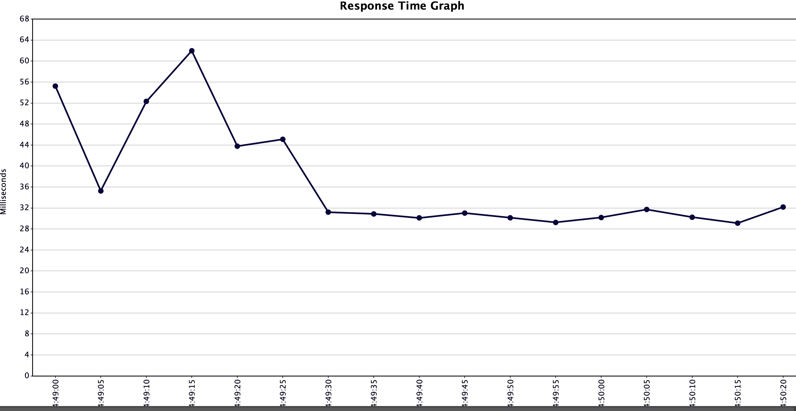
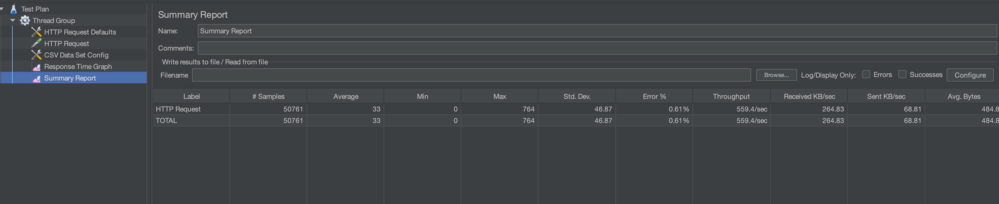

# Побудова розподіленого застосування, що працює з великим навантаженням

1. Створити команду
2. Обрати предметну область
3. Зробити постановку задачі
4. Описати архітектуру
5. Розробити прототип
6. Зробити навантажувальне тестування
7. Описати результати

На іспиті команда має презентувати свою роботу. Акцент зробити на індивідуальну роботу (що саме було виконано кожним членом команди).

## Предменна область та постановка задачі

Застосунок, який дозволяє заміняти довгі URL посилання на короткі.
Тобто, користувач надає посилання вигляду http://somehost/very/long/.../url,
взамін отримує коротке посилання вигляду http://tinyurl/d4hb3eijdf.
При переході на коротке посилання застосунок має перенаправляти на оригінальне. 

Очікується, що переходи по скороченим посиланням -- це основне навантаження,
під яким буде система.

## Архітектура

Для довгих посилань вигляду http://somehost/very/long/.../url (`external_url`)
генеруємо `short_id` з літер та цифр, наприклад, `d4hb3eijdf`, та зберігаємо
пару `short_id`/`external_url` в базі даних.

Для генерації `short_id` доречно обрати спосіб, який би не вимагав синхронізації
між машинам застосунку. Для цього можна взяти перші символи хешу UUID.

## Прототип

Написаний на Ruby On Rails, в якості бази даних використовується реляційна базу даних (Postgres)
з кешуванням (Redis). Інстанси веб додатку знаходяться за load balancer,
в ролі якого виступає Nginx.

## Навантажувальне тестування

Проводилось локально в Докері за допомогою JMeter. Для усунення конкуренції JMeter
та інстансів у Докері за CPU, останнім було обмежено CPU ресурс до 0.25 від ядра.

## Результати

Конфігурація: 10000 записів в БД, пʼять інстансів застосунку.
Параметри тестування: 20 одночасних користувачів які проходять за короткими
посиланнями, що є в БД.
Інтерпретація: ріст response time протягом перших 10-20 секунд пояснюється тим, що
дані потрібно брати з реляційної БД. Після цього дані знаходяться в кеші, тому
response time знижується.

